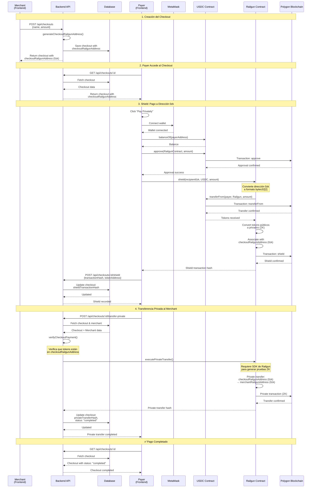

# Flujo de Pagos Privados con Railgun

Este documento explica cómo funciona el flujo de pagos privados usando Railgun en PrivPay.

## Flujo Completo

### 1. Creación del Checkout

Cuando un merchant crea un checkout:

```typescript
POST /api/checkouts
{
  "name": "Product Payment",
  "amount": 100.00
}
```

**Backend:**
- Genera una dirección 0zk única para el checkout usando `generateCheckoutRailgunAddress()`
- Guarda el checkout con `checkoutRailgunAddress` en la base de datos
- Retorna el checkout incluyendo la dirección 0zk

**Respuesta:**
```json
{
  "_id": "checkout_id",
  "name": "Product Payment",
  "amount": "100000000", // En formato de almacenamiento (6 decimales)
  "status": "pending",
  "checkoutRailgunAddress": "0zk1abc...",
  "createdAt": "..."
}
```

### 2. Payer Recibe la Dirección del Checkout

El payer accede a la página del checkout:

```
GET /api/checkouts/:id
```

**Frontend muestra:**
- Monto del pago
- Dirección 0zk del checkout (`checkoutRailgunAddress`)
- Botón "Pay Privately with Railgun"

### 3. Shield: Pago a la Dirección 0zk del Checkout

⚠️ **IMPORTANTE**: MetaMask NO puede enviar directamente a una dirección 0zk. Las direcciones 0zk no son direcciones Ethereum válidas.

**El proceso correcto es:**
1. El usuario aprueba USDC al **contrato Railgun** (no a la dirección 0zk)
2. Se llama a la función `shield()` del contrato Railgun
3. El contrato Railgun convierte los tokens públicos a privados y los asocia con la dirección 0zk

Cuando el payer hace clic en "Pay Privately with Railgun":

**Frontend (`handleShieldPayment`):**
1. Conecta la wallet del usuario (MetaMask)
2. Obtiene el contrato USDC y el contrato Railgun
3. Verifica el balance del usuario
4. Calcula el fee (0.25%)
5. **Usa `permit` (EIP-2612) en lugar de `approve`**:
   - Firma un mensaje off-chain (sin gas)
   - Ejecuta `permit()` on-chain (o combina con shield si es posible)
   - Si permit no está disponible, fallback a `approve()`
6. **Ejecuta `railgunContract.shield()`** con:
   - La dirección 0zk convertida al formato del contrato (bytes32[2])
   - El token (USDC)
   - La cantidad
7. MetaMask muestra la transacción para firmar
8. Espera confirmación de la transacción
9. Notifica al backend con el hash de la transacción

**Código clave:**
```typescript
// ❌ INCORRECTO - Esto fallaría:
await usdcContract.transfer(checkoutRailgunAddress, amount)

// ✅ CORRECTO - Esto es lo que hacemos:
// 1. Usar permit (EIP-2612) en lugar de approve (mejor UX)
const permitSignature = await signPermit(
  signer,
  usdcContract,
  userAddress,
  railgunContractAddress,
  amount,
  deadline
)

// 2. Ejecutar permit on-chain
await usdcContract.permit(
  userAddress,
  railgunContractAddress,
  amount,
  deadline,
  permitSignature.v,
  permitSignature.r,
  permitSignature.s
)

// 3. Llamar shield() del contrato Railgun
await railgunContract.shield(
  recipientBytes, // Dirección 0zk convertida a formato del contrato
  tokenAddress,
  amountAfterFee
)

// NOTA: Si el contrato Railgun soporta permit directamente,
// podríamos combinar permit + shield en una sola transacción
```

**Backend (`POST /api/checkouts/:id/shield`):**
- Recibe el `transactionHash` del shield
- Guarda `shieldTransactionHash` en el checkout
- Cambia el estado a "pending" (o "shielded" cuando se implemente)

### 4. Transferencia Privada al Merchant

Después de que el shield se confirma, se ejecuta automáticamente:

**Backend (`POST /api/checkouts/:id/transfer-private`):**
1. Verifica que el shield fue completado (`shieldTransactionHash` existe)
2. Verifica que el pago fue recibido en la dirección 0zk del checkout
3. Obtiene la dirección 0zk del merchant desde el User model
4. Ejecuta `executePrivateTransfer()`:
   - Transfiere tokens privadamente desde `checkoutRailgunAddress` 
   - A `user.railgunAddress` (dirección 0zk del merchant)
5. Guarda `privateTransferHash` en el checkout
6. Cambia el estado a "completed"

**NOTA:** La transferencia privada requiere el SDK completo de Railgun para generar las pruebas ZK. Actualmente está como placeholder.

## Estructura de Datos

### Checkout Model

```typescript
{
  _id: string
  name: string
  amount: string // Formato de almacenamiento (6 decimales)
  status: 'pending' | 'completed' | 'failed'
  userId: ObjectId // ID del merchant
  checkoutRailgunAddress: string // Dirección 0zk única del checkout
  shieldTransactionHash?: string // Hash de la transacción de shield
  privateTransferHash?: string // Hash de la transferencia privada
  transactionHash?: string // Hash de transacción legacy (x402)
  createdAt: Date
  updatedAt: Date
}
```

### User Model

```typescript
{
  _id: ObjectId
  privyId: string
  name: string
  email?: string
  walletAddress?: string
  railgunAddress: string // Dirección 0zk del merchant
  railgunPrivateKey: string // Clave privada para Railgun
  createdAt: Date
  updatedAt: Date
}
```

## Endpoints

### POST /api/checkouts
Crea un nuevo checkout y genera su dirección 0zk única.

**Request:**
```json
{
  "name": "Product Payment",
  "amount": 100.00
}
```

**Response:**
```json
{
  "_id": "checkout_id",
  "name": "Product Payment",
  "amount": "100000000",
  "status": "pending",
  "checkoutRailgunAddress": "0zk1abc...",
  "createdAt": "..."
}
```

### GET /api/checkouts/:id
Obtiene los detalles del checkout, incluyendo la dirección 0zk.

**Response:**
```json
{
  "_id": "checkout_id",
  "name": "Product Payment",
  "amount": "100000000",
  "status": "pending",
  "checkoutRailgunAddress": "0zk1abc...",
  "shieldTransactionHash": null,
  "privateTransferHash": null,
  "createdAt": "..."
}
```

### POST /api/checkouts/:id/shield
Registra una transacción de shield completada.

**Request:**
```json
{
  "transactionHash": "0x...",
  "tokenAddress": "0x833589fCD6eDb6E08f4c7C32D4f71b54bdA02913"
}
```

**Response:**
```json
{
  "message": "Shield transaction recorded",
  "transactionHash": "0x...",
  "checkoutRailgunAddress": "0zk1abc..."
}
```

### POST /api/checkouts/:id/transfer-private
Ejecuta la transferencia privada desde el checkout al merchant.

**Response:**
```json
{
  "message": "Private transfer completed",
  "transactionHash": "0x..."
}
```

## Diagrama de Secuencia



## Flujo Visual (ASCII)

```
┌─────────────┐
│   Merchant  │
│  (crea)     │
└──────┬──────┘
       │
       │ POST /api/checkouts
       │ { name, amount }
       ▼
┌─────────────────────────────┐
│      Backend                │
│  - Genera checkoutRailgun  │
│    Address (0zk)            │
│  - Guarda checkout         │
└──────┬──────────────────────┘
       │
       │ Retorna checkout con 0zk address
       ▼
┌─────────────┐
│   Checkout  │
│   Page      │
│  (muestra)  │
└──────┬──────┘
       │
       │ Payer ve dirección 0zk
       │ y hace clic en "Pay Privately"
       ▼
┌─────────────────────────────┐
│      Frontend               │
│  - Conecta wallet           │
│  - Ejecuta shield()         │
│  - Tokens → checkoutRailgun│
│    Address (0zk)            │
└──────┬──────────────────────┘
       │
       │ POST /api/checkouts/:id/shield
       │ { transactionHash }
       ▼
┌─────────────────────────────┐
│      Backend                │
│  - Guarda shieldTxHash      │
│  - Verifica pago recibido   │
│  - Ejecuta private transfer │
│    (checkout 0zk → merchant │
│     0zk)                     │
│  - Guarda privateTransferHash│
│  - Estado: completed        │
└─────────────────────────────┘
```

## Ventajas del Flujo

1. **Privacidad del Payer**: El payer envía tokens a una dirección 0zk única del checkout, no directamente al merchant
2. **Privacidad del Merchant**: El merchant recibe tokens en su dirección 0zk privada
3. **Sin Trazabilidad**: Las transferencias privadas dentro de Railgun no son visibles públicamente
4. **Direcciones Únicas**: Cada checkout tiene su propia dirección 0zk, permitiendo rastreo interno sin comprometer privacidad

## Limitaciones Actuales

⚠️ **Importante**: Esta implementación tiene limitaciones:

1. **Generación de Direcciones**: Las direcciones 0zk generadas son simplificadas. En producción, usa el SDK de Railgun para generar direcciones válidas.

2. **Transferencia Privada**: La función `executePrivateTransfer()` requiere el SDK completo de Railgun para generar pruebas ZK. Actualmente está como placeholder.

3. **Verificación de Pagos**: La verificación de pagos en direcciones 0zk requiere el SDK de Railgun para consultar balances privados.

## Próximos Pasos

Para una implementación completa:

1. **Integrar SDK de Railgun**:
   ```typescript
   import { startRailgunEngine, createRailgunWallet } from '@railgun-community/wallet'
   ```

2. **Inicializar Engine**:
   ```typescript
   await startRailgunEngine({
     network: NetworkName.Polygon,
     // ... configuración
   })
   ```

3. **Generar Direcciones Reales**:
   ```typescript
   const wallet = await createRailgunWallet(mnemonic, encryptionKey)
   const railgunAddress = wallet.getAddress()
   ```

4. **Implementar Transferencias Privadas**:
   ```typescript
   const privateTransfer = await wallet.transfer({
     to: recipient0zk,
     token: tokenAddress,
     amount: amount
   })
   ```

## Variables de Entorno Necesarias

```env
# Backend
RAILGUN_CONTRACT_ADDRESS=0x... # Contrato Railgun en Polygon
USDC_CONTRACT_ADDRESS=0x833589fCD6eDb6E08f4c7C32D4f71b54bdA02913
CHECKOUT_WALLET_PRIVATE_KEY=0x... # Para ejecutar transferencias privadas
POLYGON_RPC_URL=https://polygon-rpc.com

# Frontend
VITE_USDC_CONTRACT_ADDRESS=0x833589fCD6eDb6E08f4c7C32D4f71b54bdA02913
VITE_RAILGUN_CONTRACT_ADDRESS=0x... # Contrato Railgun en Polygon
```

## Seguridad

🔒 **Consideraciones importantes**:

- Las claves privadas deben estar encriptadas en la base de datos
- Nunca expongas claves privadas en el frontend
- Usa variables de entorno para todas las claves y direcciones de contratos
- En producción, implementa rate limiting y validación de transacciones
- Considera usar un servicio de relayer para ejecutar transferencias privadas automáticamente

