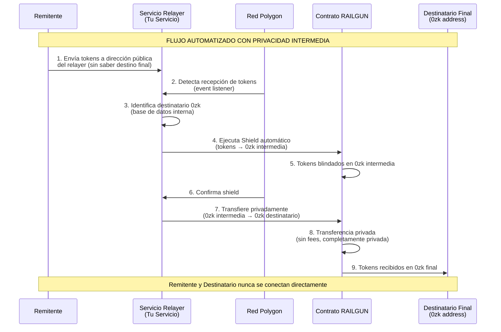
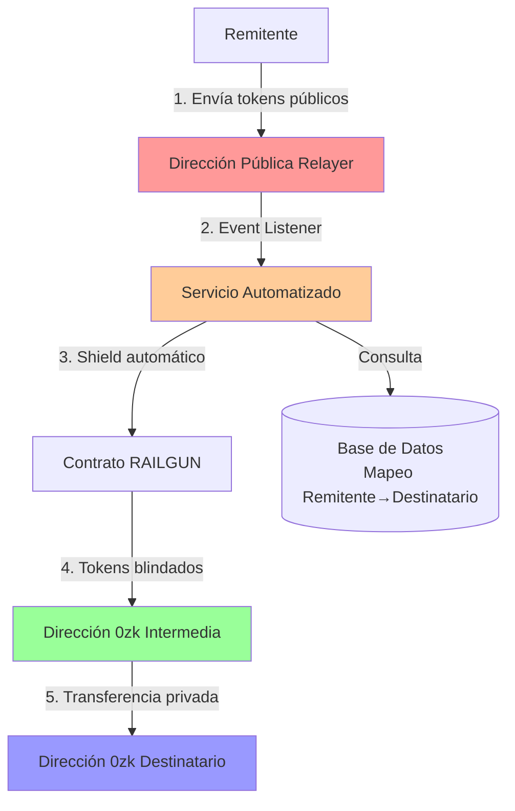

# Automatización de Shield con Capa Intermedia de Privacidad

## Concepto: Capa Intermedia de Privacidad

Para crear una capa de privacidad entre el remitente y el destinatario, implementamos un **servicio relayer intermedio** que:

1. **Recibe tokens** en una dirección pública intermedia (visible para el remitente)
2. **Blinda automáticamente** los tokens a una dirección 0zk intermedia
3. **Transfiere privadamente** los tokens desde la dirección 0zk intermedia a la dirección 0zk final del destinatario

**Ventajas de esta arquitectura:**
- El remitente solo ve que envía a una dirección pública intermedia
- El destinatario recibe desde una dirección 0zk intermedia, no directamente del remitente
- La relación entre remitente original y destinatario final queda completamente oculta
- El proceso es completamente automatizado

## Diagrama de Secuencia - Automatización con Capa Intermedia



## Arquitectura del Sistema



## Implementación

### 1. Configuración del Servicio Relayer

El servicio necesita:
- Una dirección pública en Polygon para recibir tokens
- Una dirección 0zk intermedia para blindar tokens
- Una billetera con MATIC para pagar gas fees
- Un sistema de mapeo remitente → destinatario 0zk

### 2. Monitoreo de Eventos en Blockchain

El servicio debe monitorear eventos de transferencia de tokens ERC-20 a la dirección pública del relayer.

### 3. Automatización del Shield

Cuando se detecta una transferencia:
1. Identificar el remitente y buscar su destinatario 0zk asociado
2. Ejecutar automáticamente el shield a la dirección 0zk intermedia
3. Transferir privadamente desde la 0zk intermedia a la 0zk del destinatario

## Código de Ejemplo - Automatización con Ethers.js

```typescript
import { ethers } from 'ethers';
import { RailgunSmartWalletContract } from '@railgun-community/contracts';

// Configuración
const POLYGON_RPC = 'https://polygon-rpc.com';
const RELAYER_PUBLIC_ADDRESS = '0x...'; // Tu dirección pública del relayer
const RELAYER_0ZK_ADDRESS = '0zk1...'; // Tu dirección 0zk intermedia
const RAILGUN_CONTRACT_ADDRESS = '0x...'; // Contrato RAILGUN en Polygon

// Base de datos de mapeo (en producción usar Redis/PostgreSQL)
const recipientMapping = new Map<string, string>();

interface ShieldRequest {
  from: string;
  token: string;
  amount: string;
  recipient0zk: string;
}

class AutomatedShieldService {
  private provider: ethers.Provider;
  private wallet: ethers.Wallet;
  private tokenContract: ethers.Contract;
  
  constructor(privateKey: string) {
    this.provider = new ethers.JsonRpcProvider(POLYGON_RPC);
    this.wallet = new ethers.Wallet(privateKey, this.provider);
  }

  // Registrar mapeo remitente → destinatario 0zk
  registerRecipient(senderAddress: string, recipient0zk: string) {
    recipientMapping.set(senderAddress.toLowerCase(), recipient0zk);
  }

  // Monitorear transferencias entrantes
  async startMonitoring(tokenAddress: string) {
    const tokenABI = [
      'event Transfer(address indexed from, address indexed to, uint256 value)'
    ];
    
    const tokenContract = new ethers.Contract(
      tokenAddress,
      tokenABI,
      this.provider
    );

    // Filtrar solo transferencias a nuestra dirección
    const filter = tokenContract.filters.Transfer(null, RELAYER_PUBLIC_ADDRESS);
    
    tokenContract.on(filter, async (from, to, amount, event) => {
      console.log(`Token recibido: ${ethers.formatEther(amount)} de ${from}`);
      
      // Obtener destinatario 0zk asociado
      const recipient0zk = recipientMapping.get(from.toLowerCase());
      
      if (recipient0zk) {
        await this.processShield({
          from,
          token: tokenAddress,
          amount: amount.toString(),
          recipient0zk
        });
      } else {
        console.warn(`No se encontró destinatario 0zk para ${from}`);
      }
    });

    console.log('Monitoreo iniciado...');
  }

  // Procesar shield automático
  async processShield(request: ShieldRequest) {
    try {
      console.log(`Iniciando shield automático para ${request.from}...`);
      
      // Paso 1: Shield a dirección 0zk intermedia
      const shieldTx = await this.executeShield(
        request.token,
        request.amount,
        RELAYER_0ZK_ADDRESS
      );
      
      await shieldTx.wait();
      console.log(`Shield completado: ${shieldTx.hash}`);
      
      // Paso 2: Transferencia privada a destinatario final
      await this.transferPrivate(
        request.token,
        request.amount,
        request.recipient0zk
      );
      
      console.log(`Transferencia privada completada a ${request.recipient0zk}`);
      
    } catch (error) {
      console.error('Error en proceso de shield:', error);
      throw error;
    }
  }

  // Ejecutar shield (interacción con contrato RAILGUN)
  async executeShield(
    tokenAddress: string,
    amount: string,
    recipient0zk: string
  ) {
    // Aprobar tokens al contrato RAILGUN
    const tokenContract = new ethers.Contract(
      tokenAddress,
      [
        'function approve(address spender, uint256 amount) returns (bool)',
        'function allowance(address owner, address spender) view returns (uint256)'
      ],
      this.wallet
    );

    const railgunContract = new ethers.Contract(
      RAILGUN_CONTRACT_ADDRESS,
      [
        'function shield(bytes32[2] recipient, address token, uint256 amount)',
        'function getShieldFee(uint256 amount) view returns (uint256)'
      ],
      this.wallet
    );

    // Calcular fee (0.25%)
    const fee = await railgunContract.getShieldFee(amount);
    const amountAfterFee = BigInt(amount) - BigInt(fee);

    // Verificar y aprobar si es necesario
    const allowance = await tokenContract.allowance(
      this.wallet.address,
      RAILGUN_CONTRACT_ADDRESS
    );
    
    if (allowance < amount) {
      const approveTx = await tokenContract.approve(
        RAILGUN_CONTRACT_ADDRESS,
        ethers.MaxUint256
      );
      await approveTx.wait();
    }

    // Convertir dirección 0zk a formato del contrato
    const recipientBytes = this.parse0zkAddress(recipient0zk);

    // Ejecutar shield
    const shieldTx = await railgunContract.shield(
      recipientBytes,
      tokenAddress,
      amountAfterFee,
      { gasLimit: 500000 }
    );

    return shieldTx;
  }

  // Transferencia privada dentro de RAILGUN (sin fees)
  async transferPrivate(
    tokenAddress: string,
    amount: string,
    recipient0zk: string
  ) {
    // Esta función requiere usar el SDK de RAILGUN para generar
    // las pruebas de conocimiento cero necesarias
    // Ejemplo conceptual:
    
    // const railgunSDK = new RailgunSDK();
    // const privateTransfer = await railgunSDK.transfer({
    //   from: RELAYER_0ZK_ADDRESS,
    //   to: recipient0zk,
    //   token: tokenAddress,
    //   amount: amount
    // });
    // 
    // return await this.wallet.sendTransaction(privateTransfer);
    
    console.log('Transferencia privada (requiere SDK de RAILGUN)');
  }

  // Helper: Parsear dirección 0zk
  private parse0zkAddress(address0zk: string): [string, string] {
    // Implementar conversión de dirección 0zk a formato del contrato
    // Esto depende de la implementación específica de RAILGUN
    return ['0x...', '0x...'];
  }
}

// Uso del servicio
async function main() {
  const PRIVATE_KEY = process.env.RELAYER_PRIVATE_KEY!;
  const service = new AutomatedShieldService(PRIVATE_KEY);

  // Registrar destinatarios
  service.registerRecipient(
    '0xRemitente1...',
    '0zk1Destinatario1...'
  );

  // Iniciar monitoreo para USDC en Polygon
  const USDC_POLYGON = '0x2791Bca1f2de4661ED88A30C99A7a9449Aa84174';
  await service.startMonitoring(USDC_POLYGON);
}

main().catch(console.error);
```

## Implementación con OpenZeppelin Defender (Recomendado)

Para producción, se recomienda usar **OpenZeppelin Defender** que proporciona:

1. **Sentinels**: Monitorean eventos en la blockchain
2. **Autotasks**: Ejecutan código automáticamente
3. **Relayers**: Firman transacciones de forma segura

### Configuración de Sentinel

```javascript
// Defender Sentinel Configuration
{
  "name": "Monitor Token Transfers to Relayer",
  "address": "0x2791Bca1f2de4661ED88A30C99A7a9449Aa84174", // USDC
  "network": "polygon",
  "abi": [/* ERC20 ABI */],
  "eventConditions": [
    {
      "eventSignature": "Transfer(address,address,uint256)",
      "expression": "to == '0xRELAYER_ADDRESS'"
    }
  ],
  "autotaskCondition": {
    "autotaskId": "auto-shield-task-id"
  }
}
```

### Autotask para Shield Automático

```javascript
// Defender Autotask
const { DefenderRelayProvider, DefenderRelaySigner } = require('defender-relay-client/lib/ethers');
const { ethers } = require('ethers');

exports.handler = async function(event) {
  const { request } = event;
  const provider = new DefenderRelayProvider(request);
  const signer = new DefenderRelaySigner(request, provider, { speed: 'fast' });
  
  // Procesar evento de transferencia
  const transferEvent = event.matchReasons[0].params;
  const from = transferEvent.from;
  const amount = transferEvent.value;
  
  // Obtener destinatario 0zk (desde base de datos)
  const recipient0zk = await getRecipient0zk(from);
  
  if (recipient0zk) {
    // Ejecutar shield automático
    await executeShield(signer, transferEvent.address, amount, recipient0zk);
  }
  
  return { status: 'success' };
};
```

## Consideraciones de Seguridad

1. **Gestión de Claves Privadas**
   - Nunca almacenes claves privadas en código
   - Usa servicios como OpenZeppelin Defender o AWS Secrets Manager
   - Implementa rotación de claves

2. **Validación de Transacciones**
   - Verifica que el remitente esté autorizado
   - Valida límites de cantidad
   - Implementa rate limiting

3. **Manejo de Errores**
   - Implementa retry logic para transacciones fallidas
   - Monitorea gas prices para optimizar costos
   - Registra todas las operaciones para auditoría

4. **Privacidad de la Base de Datos**
   - Encripta el mapeo remitente → destinatario
   - Implementa acceso controlado
   - Considera usar técnicas de zero-knowledge para el mapeo

## Costos Estimados

- **Shield Fee**: 0.25% del monto (gestionado por RAILGUN DAO)
- **Gas Fee**: ~0.01-0.05 MATIC por transacción de shield
- **Transferencia Privada**: Sin fees (dentro de RAILGUN)
- **Total por transacción**: ~0.25% + 0.01-0.05 MATIC

## Próximos Pasos

1. **Configurar entorno de desarrollo**
   - Instalar dependencias (ethers.js, RAILGUN SDK)
   - Configurar conexión a Polygon
   - Crear billetera del relayer

2. **Implementar base de datos**
   - Diseñar esquema de mapeo remitente → destinatario
   - Implementar API para registro de destinatarios

3. **Desarrollar servicio de monitoreo**
   - Implementar event listeners
   - Configurar manejo de errores y retries

4. **Integrar con RAILGUN SDK**
   - Configurar shield automático
   - Implementar transferencias privadas

5. **Testing en testnet**
   - Probar en una red de pruebas de Polygon
   - Validar flujo completo
   - Optimizar gas costs

6. **Despliegue en producción**
   - Usar OpenZeppelin Defender o similar
   - Configurar monitoreo y alertas
   - Implementar backup y recovery

