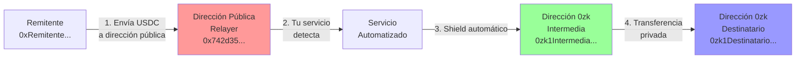

# Explicación: Dirección Pública del Relayer

## ¿Qué es una Dirección Pública?

Una **dirección pública** es una dirección de billetera tradicional en blockchain (como las que usas en MetaMask). Estas direcciones:

- ✅ Son **visibles públicamente** en la blockchain
- ✅ Comienzan con `0x` (ejemplo: `0x742d35Cc6634C0532925a3b844Bc9e7595f0bEb`)
- ✅ Cualquiera puede ver el balance y las transacciones
- ✅ Son necesarias para recibir tokens ERC-20 normales

## ¿Qué es el Relayer?

El **relayer** (o "relé") es **tu servicio automatizado** que actúa como intermediario entre el remitente y el destinatario. En este contexto:

- Es un **servicio/servidor** que tú controlas
- Tiene una **billetera con clave privada** para firmar transacciones
- **Monitorea** la blockchain esperando recibir tokens
- **Procesa automáticamente** los tokens recibidos

## ¿Qué es la "Dirección Pública del Relayer"?

La **dirección pública del relayer** es simplemente la dirección de billetera tradicional (que comienza con `0x`) asociada a la billetera que controla tu servicio automatizado.

### Ejemplo Visual:

```
┌─────────────────────────────────────────┐
│         TU SERVICIO RELAYER             │
│  (Código que corre en tu servidor)      │
└─────────────────────────────────────────┘
              │
              │ Controla
              ▼
┌─────────────────────────────────────────┐
│    BILLETERA DEL RELAYER                │
│                                          │
│  Clave Privada: 0xabc123... (secreta)   │
│  Dirección Pública: 0x742d35... (pública)│
└─────────────────────────────────────────┘
```

## ¿Por Qué Necesitas una Dirección Pública?

### Razón 1: Recibir Tokens del Remitente

Los remitentes **no pueden enviar tokens directamente a direcciones 0zk** desde una billetera normal. Necesitan enviar a una dirección pública primero.

```
Remitente → [Envía USDC] → Dirección Pública del Relayer (0x742d35...)
                              ↓
                         (Tu servicio detecta)
                              ↓
                         [Shield automático]
                              ↓
                    Dirección 0zk Intermedia (0zk1...)
                              ↓
                    [Transferencia privada]
                              ↓
                    Dirección 0zk Destinatario (0zk1...)
```

### Razón 2: Pagar Gas Fees

Para ejecutar el shield, necesitas MATIC (o el token nativo) en una dirección pública para pagar las tarifas de gas.

## Comparación: Dirección Pública vs Dirección 0zk

| Característica | Dirección Pública (0x...) | Dirección 0zk (0zk1...) |
|----------------|---------------------------|-------------------------|
| **Formato** | `0x742d35Cc6634...` | `0zk1qyn0qa5rgk7z2...` |
| **Visibilidad** | ✅ Pública en blockchain | 🔒 Privada (encriptada) |
| **Balance visible** | ✅ Sí, cualquiera puede ver | ❌ No, solo el dueño |
| **Transacciones visibles** | ✅ Sí, en exploradores | ❌ No, privadas |
| **Puede recibir tokens ERC-20** | ✅ Sí, directamente | ❌ No, requiere shield primero |
| **Puede pagar gas** | ✅ Sí | ❌ No directamente |
| **Uso en este sistema** | Recibir tokens del remitente | Recibir tokens blindados |

## Flujo Completo con Direcciones



## Ejemplo Práctico

Imagina que eres un servicio de pagos privados:

### Configuración Inicial:

1. **Creas una billetera** (puedes usar MetaMask, o generar una programáticamente):
   ```
   Clave Privada: 0xabc123def456... (GUARDADA EN SEGRETO)
   Dirección Pública: 0x742d35Cc6634C0532925a3b844Bc9e7595f0bEb
   ```

2. **Creas una dirección 0zk intermedia** (en Railway Wallet):
   ```
   Dirección 0zk Intermedia: 0zk1qyn0qa5rgk7z2l8wyncpynmydgj7ucrrcczhl8k27q2rw5ldvv2qrrv7j6fe3z53ll5j4fjs9j5cmq7mxsaulah7ykk6jwqna3nwvxudp5w6fwyg8cgwkwwv3g4
   ```

3. **Configuras tu servicio** con estas direcciones:
   ```typescript
   RELAYER_PUBLIC_ADDRESS = "0x742d35Cc6634C0532925a3b844Bc9e7595f0bEb"
   RELAYER_0ZK_ADDRESS = "0zk1qyn0qa5rgk7z2l8wyncpynmydgj7ucrrcczhl8k27q2rw5ldvv2qrrv7j6fe3z53ll5j4fjs9j5cmq7mxsaulah7ykk6jwqna3nwvxudp5w6fwyg8cgwkwwv3g4"
   ```

### Flujo de una Transacción:

1. **Cliente A** quiere enviar 100 USDC a **Cliente B** de forma privada
2. **Cliente A** envía 100 USDC a `0x742d35Cc6634C0532925a3b844Bc9e7595f0bEb` (tu dirección pública)
3. Tu servicio detecta la transferencia
4. Tu servicio busca en la base de datos: "¿Quién es el destinatario de Cliente A?"
5. Encuentra que Cliente A → Cliente B (dirección 0zk: `0zk1ClienteB...`)
6. Tu servicio ejecuta shield: 100 USDC → `0zk1Intermedia...` (tu dirección 0zk intermedia)
7. Tu servicio transfiere privadamente: `0zk1Intermedia...` → `0zk1ClienteB...`
8. **Cliente B** recibe los tokens en su dirección 0zk privada

### Lo que Ve Cada Parte:

- **Cliente A (Remitente)**:
  - Ve que envió a: `0x742d35Cc6634C0532925a3b844Bc9e7595f0bEb`
  - ❌ NO sabe quién es el destinatario final
  - ❌ NO puede ver que los tokens fueron a `0zk1ClienteB...`

- **Cliente B (Destinatario)**:
  - Ve que recibió tokens en: `0zk1ClienteB...`
  - Ve que vienen de: `0zk1Intermedia...` (tu dirección 0zk intermedia)
  - ❌ NO sabe quién fue el remitente original
  - ❌ NO puede ver la dirección `0x742d35...`

- **Observador Externo**:
  - Ve que Cliente A envió a `0x742d35...`
  - Ve que `0x742d35...` hizo un shield
  - ❌ NO puede ver a quién se transfirieron los tokens después del shield
  - ❌ NO puede conectar Cliente A con Cliente B

## ¿Cómo Obtener una Dirección Pública del Relayer?

### Opción 1: Generar una Nueva Billetera

```typescript
import { ethers } from 'ethers';

// Generar nueva billetera
const wallet = ethers.Wallet.createRandom();

console.log('Clave Privada:', wallet.privateKey);
console.log('Dirección Pública:', wallet.address);
```

### Opción 2: Usar una Billetera Existente

Si ya tienes una billetera (MetaMask, etc.), puedes usar esa dirección pública.

⚠️ **IMPORTANTE**: 
- La clave privada debe estar **segura** (nunca en código)
- Usa variables de entorno o servicios de gestión de secretos
- En producción, considera usar un wallet multisig

## Resumen

La **dirección pública del relayer** es:

1. ✅ Una dirección de billetera tradicional (`0x...`)
2. ✅ La dirección donde los remitentes envían tokens
3. ✅ Controlada por tu servicio automatizado
4. ✅ Necesaria para recibir tokens antes de blindarlos
5. ✅ Necesaria para pagar gas fees

Es diferente de la **dirección 0zk intermedia**, que es:
- Una dirección privada de RAILGUN (`0zk1...`)
- Donde se blindan los tokens temporalmente
- Desde donde se transfieren privadamente al destinatario final

Ambas direcciones son necesarias para el funcionamiento del sistema de privacidad intermedia.

