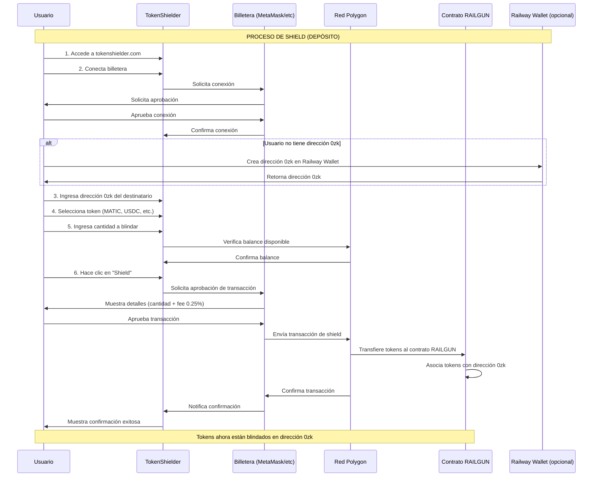
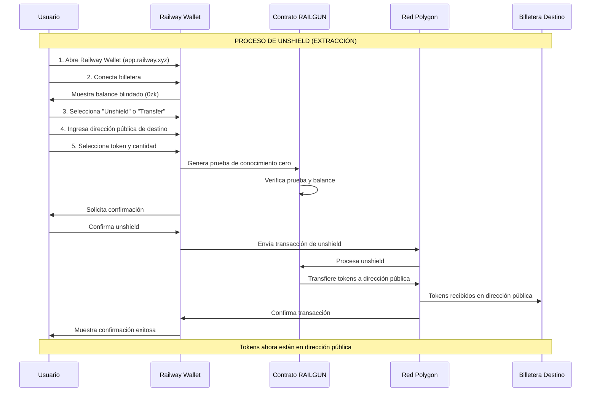

# TokenShielder - Guía de Funcionamiento en Polygon

## ¿Qué es TokenShielder?

TokenShielder es una plataforma web que permite transferir tokens directamente desde tu billetera pública a una dirección privada **0zk** de RAILGUN. RAILGUN es un sistema de privacidad que encripta balances y transacciones, protegiendo tu información financiera de la vista pública en la blockchain.

## Conceptos Clave

- **Shield (Blindar)**: Proceso de enviar tokens desde una dirección pública a una dirección privada 0zk de RAILGUN
- **Unshield (Desblindar)**: Proceso de sacar tokens desde una dirección privada 0zk de vuelta a una dirección pública
- **Dirección 0zk**: Dirección privada de RAILGUN que comienza con "0zk" y permite recibir tokens blindados
- **Fee**: Las transacciones de shield tienen una comisión del 0.25% (gestionada por RAILGUN DAO)

## ¿Cómo se Crea una Dirección 0zk?

Las direcciones **0zk** son direcciones privadas utilizadas en el protocolo RAILGUN para proporcionar privacidad en las transacciones blockchain. A diferencia de las direcciones públicas de Ethereum que usan claves ECDSA con la curva secp256k1, las direcciones 0zk utilizan un sistema criptográfico diferente.

### Proceso Técnico de Creación

1. **Generación de Claves Criptográficas**:
   - Se generan **claves Ed25519** en la curva **BabyJubJub** (una curva elíptica optimizada para pruebas de conocimiento cero)
   - Se crean dos pares de claves:
     - **Clave de visualización** (viewing key): permite ver y rastrear el balance de la dirección
     - **Clave de gasto** (spending key): permite gastar los fondos asociados a la dirección

2. **Formación de la Dirección**:
   - La dirección **0zk** se forma concatenando la **clave pública de visualización** y la **clave pública de gasto**
   - Este proceso genera una dirección que comienza con el prefijo "0zk"
   - Solo el propietario de las claves privadas correspondientes puede acceder y gastar los fondos

3. **Características Importantes**:
   - **No aparece en la blockchain**: Las direcciones 0zk no se registran directamente en la cadena pública
   - **Modelo UTXO/Note**: El sistema utiliza un modelo basado en notas (notes) junto con pruebas de conocimiento cero (zk-proofs)
   - **Estado privado**: El balance y las transacciones se mantienen privados mediante criptografía

### Cómo Obtener una Dirección 0zk

**Opción 1: Railway Wallet (Recomendado)**
1. Visita [app.railway.xyz](https://app.railway.xyz/)
2. Conecta tu billetera (MetaMask, WalletConnect, etc.)
3. Railway Wallet automáticamente genera y asocia una dirección 0zk a tu billetera pública
4. La dirección 0zk se muestra en la interfaz de Railway Wallet

**Opción 2: Integración con RAILGUN SDK**
- Las aplicaciones pueden integrar el SDK de RAILGUN para generar direcciones 0zk programáticamente
- El SDK maneja toda la criptografía necesaria de forma segura

### Diferencias Clave con Direcciones Públicas

| Característica | Dirección Pública | Dirección 0zk |
|----------------|-------------------|---------------|
| Criptografía | ECDSA (secp256k1) | Ed25519 (BabyJubJub) |
| Visibilidad | Pública en blockchain | Privada (no visible) |
| Balance | Público | Privado (solo visible para el propietario) |
| Transacciones | Públicas | Privadas mediante zk-proofs |
| Prefijo | 0x... | 0zk... |

## Diagrama de Secuencia - Proceso de Shield (Depósito) en Polygon

## Diagrama de Secuencia - Proceso de Unshield (Extracción) en Polygon

## Pasos Detallados para Shield (Depósito) en Polygon

### Paso 1: Preparación
1. Asegúrate de tener una billetera compatible (MetaMask, WalletConnect, etc.)
2. Configura tu billetera para usar la red Polygon
3. Ten tokens en tu billetera (MATIC para gas + tokens a blindar)

### Paso 2: Obtener Dirección 0zk
- Si ya tienes una dirección 0zk, úsala
- Si no, crea una en [Railway Wallet](https://app.railway.xyz/)

### Paso 3: Realizar Shield
1. Ve a [tokenshielder.com](https://tokenshielder.com/)
2. Conecta tu billetera
3. Ingresa la dirección 0zk del destinatario
4. Selecciona el token (MATIC, USDC, DAI, etc.)
5. Ingresa la cantidad
6. Haz clic en "Shield"
7. Aprueba la transacción en tu billetera
8. Espera la confirmación (puede tomar unos minutos)

**Nota**: Se cobrará una comisión del 0.25% + gas fees en MATIC

## Pasos Detallados para Unshield (Extracción) en Polygon

### Paso 1: Acceder a Railway Wallet
1. Ve a [app.railway.xyz](https://app.railway.xyz/)
2. Conecta tu billetera
3. Verás tu balance blindado (0zk)

### Paso 2: Realizar Unshield
1. Selecciona la opción "Unshield" o "Transfer"
2. Ingresa la dirección pública de destino (tu billetera o la de otro)
3. Selecciona el token y la cantidad
4. Confirma la transacción
5. Espera la confirmación

**Nota**: Las transferencias privadas dentro de RAILGUN no tienen fees, pero el unshield requiere gas fees en MATIC

## Ventajas de Usar TokenShielder/RAILGUN

1. **Privacidad**: Los balances y transacciones están encriptados
2. **Seguridad**: Reduce la exposición a ataques dirigidos
3. **Sin fees en transferencias privadas**: Una vez blindados, las transferencias entre direcciones 0zk son gratuitas
4. **DeFi Privado**: Acceso a aplicaciones DeFi privadas desde Railway Wallet

## Consideraciones Importantes

- **Fees de Shield**: 0.25% (gestionado por RAILGUN DAO, puede cambiar)
- **Gas Fees**: Necesitas MATIC en Polygon para pagar las transacciones
- **Direcciones 0zk**: Son diferentes a las direcciones públicas, asegúrate de copiarlas correctamente
- **Irreversible**: Las transacciones en blockchain son irreversibles, verifica todo antes de confirmar

## Automatización del Proceso

Sí, es posible automatizar el proceso de shield. Para más detalles sobre cómo implementar un servicio automatizado con capa intermedia de privacidad, consulta:

- **`automatizacion-shield.md`**: Guía completa con diagramas y arquitectura
- **`README-automatizacion.md`**: Documentación técnica del servicio
- **`src/shield-service.ts`**: Implementación de ejemplo en TypeScript

La automatización permite crear una capa intermedia de privacidad donde:
- El remitente envía tokens a una dirección pública intermedia
- Un servicio automatizado blinda los tokens a una dirección 0zk intermedia
- Los tokens se transfieren privadamente al destinatario final 0zk
- La relación entre remitente y destinatario queda completamente oculta

